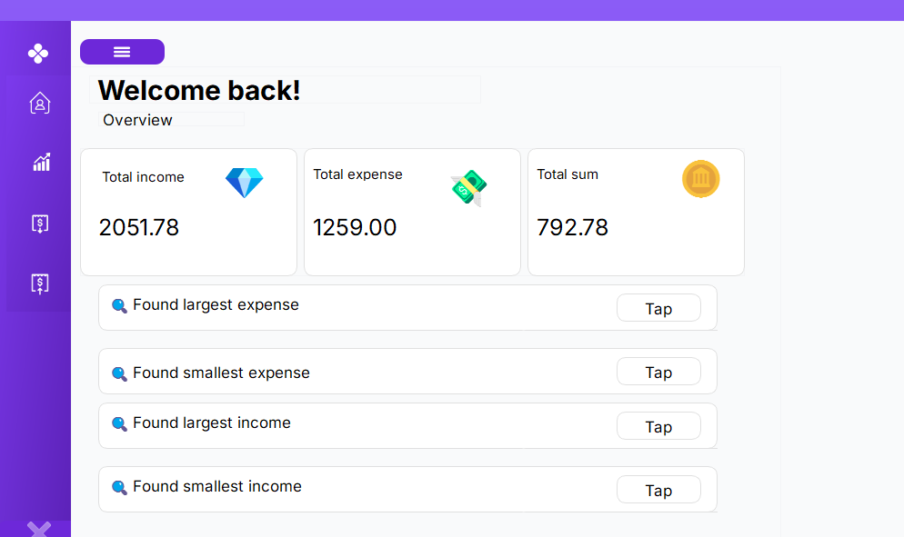
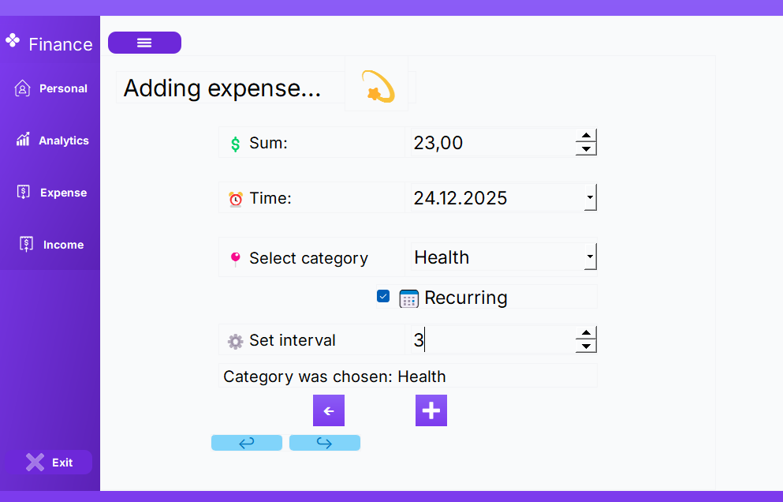
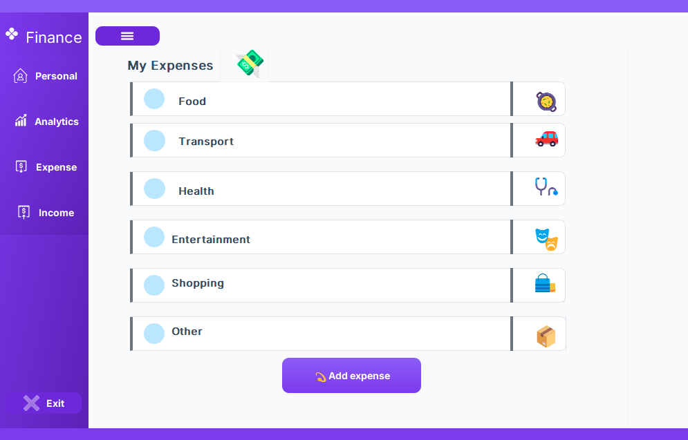
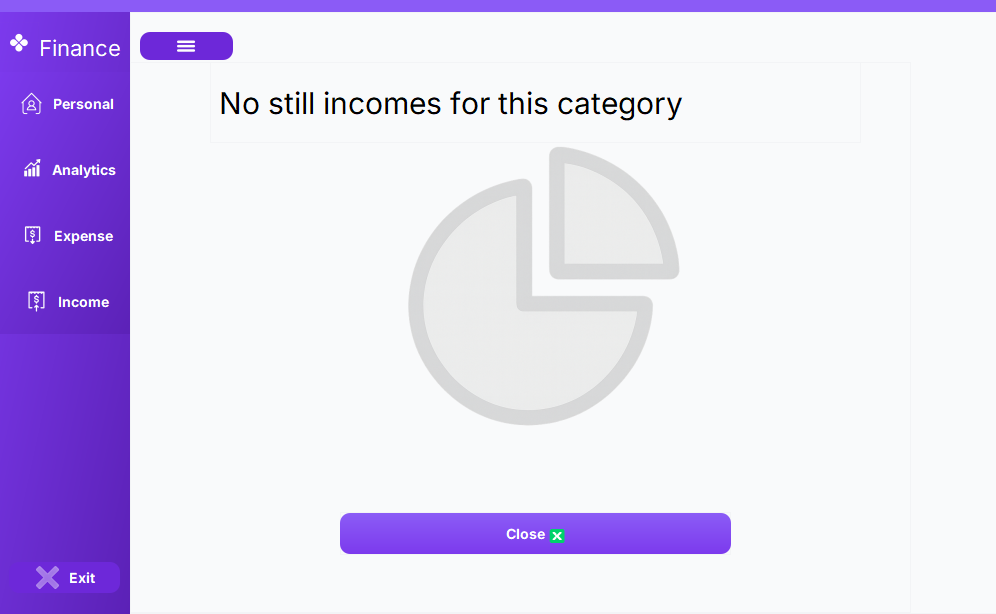
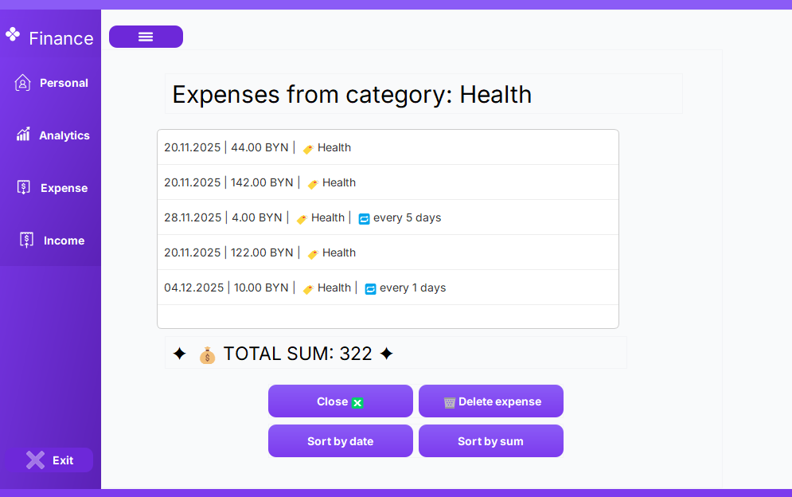
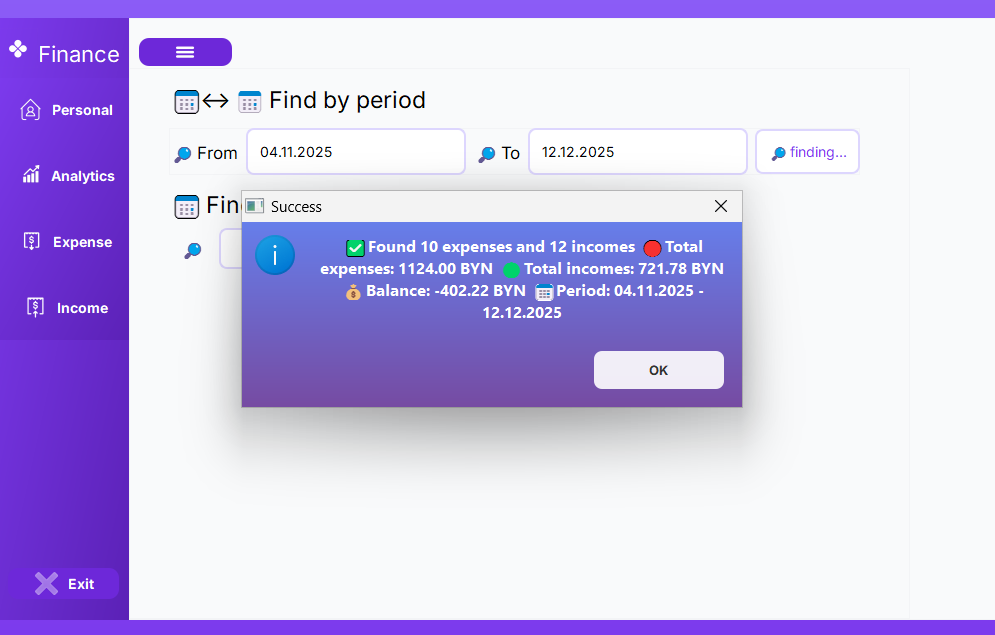
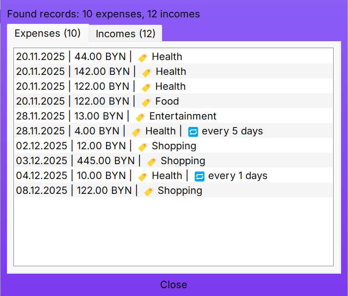
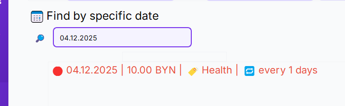
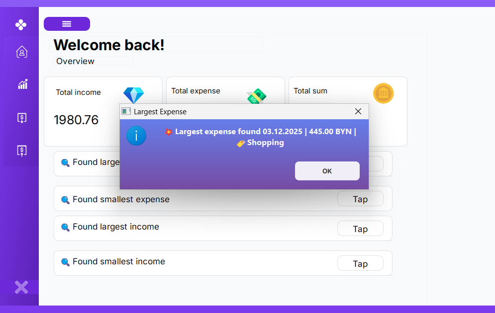

# Finance Manager 💸

A desktop application for efficient personal finance tracking and budget management. Developed using C++ and the Qt framework with **Object-Oriented Programming (OOP)** to provide a high-performance, native user experience.

## 🚀 Key Capabilities

| Feature | Description |
| :--- | :--- |
| **Income & Expense Tracking** | Log transactions with specialized categories. |
| **Tax Integration** |Flag specific income entries as "Taxed" for net-income clarity. |
| **Undo System** | One-click reversal of recent actions (Delete/Edit) using a history stack. |
| **Recurring Expenses:** | Set up automated expense logs with custom time intervals. |
| **Data Persistence**| Secure storage in local files with automatic loading on startup. |

---

## 📊 Performance & Sorting
The application provides advanced data manipulation capabilities:
* **Advanced Sorting:** View transactions by descending date or amount.
* **Time-Window Filtering:** View financial records for a specific day or a custom date range with total amount.
* **Analytics:** Instant identification of period-based reports. 
* **Automated Summaries:** Overall balance, total expenses, and total income are calculated in real-time.

---
## 📸 Interface Overview

#### 1. Main Home Page

*Overview of current balance and real-time financial summaries.*

#### 2. Adding the financial record

*Interface for adding recurring expense with interval.*

### 3. Categorized View

*Detailed list of expenses grouped by defined categories.*

*Nothing to view in the category.*

*Detailed list of expenses grouped by one chosen category.*

### 5. Entering the app

### 6. History Search

 

*Filtering transaction history by periods.*

 

*Filtering transaction history by specific date.*
### 7. Financial Highs & Lows

*Quick identificationof the largest and the smallest financial records.*

---

## 🛠 Technical Stack

* **Language:** `C++17/20` 
* **Framework:** `Qt Widgets` 
* **IDE:** `Qt Creator` 
* **Storage:** Local File I/O

## ⚙️ How to Build

1. Clone the repository.
2. Open the `.pro` file in **Qt Creator**.
3. Select your kit (e.g., Desktop Qt 6.x MSVC/MinGW).
4. Click **Build** and **Run**.

## License
This project is licensed under the [MIT License](LICENSE).
